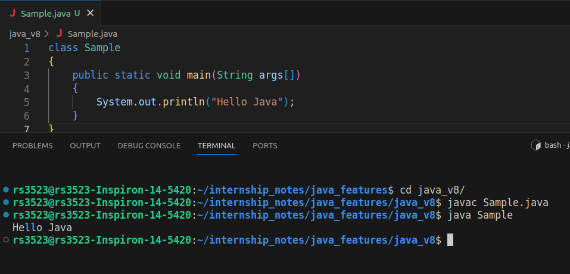

# Java
Java is a programming language and a platform. Java is a high level, robust, object-oriented and secure programming language.
**Platform**: Any hardware or software environment in which a program runs, is known as a platform. Since Java has a runtime environment (JRE) and API, it is called a platform.

```
class Sample
{
	public static void main(String args[])
	{
		System.out.println("Hello Java");
	}
}
```

# Java version: 8

* **Lambda Expressions**, a new language feature, has been introduced in this release. They enable you to treat functionality as a method argument, or code as data. Lambda expressions let you express instances of single-method interfaces (referred to as functional interfaces) more compactly.!

* Method references provide easy-to-read lambda expressions for methods that already have a name.

* Default methods enable new functionality to be added to the interfaces of libraries and ensure binary compatibility with code written for older versions of those interfaces.

* Repeating Annotations provide the ability to apply the same annotation type more than once to the same declaration or type use.

* Type Annotations provide the ability to apply an annotation anywhere a type is used, not just on a declaration. Used with a pluggable type system, this feature enables improved type checking of your code.
* Improved type inference.
* Method parameter reflection.


# Java version: 9

1. **JShell**: The Java Shell (REPL)
     
    Press ctrl + d to exit jshell
2. Stream API Improvement:
    - TakeWhile,dropWhile, ofNullable and overoladed iterate method are added
3. **Module System**: Introduce modular programming to improve scalability and maintainability.
# Java version: 10
1. **Local-Variable Type Inference**: Introduce the var keyword for local variable type inference.


# Java version: 11

1. **HTTP Client (Standard)**: Provide a native HTTP client to simplify communication with web services. 

```
HttpClient client = HttpClient.newHttpClient();
HttpRequest request = HttpRequest.newBuilder().uri(URI.create("https://example.com")).build();
HttpResponse<String> response = client.send(request, HttpResponse.BodyHandlers.ofString());
System.out.println(response.body());

```

2. **Local-Variable Syntax for Lambda Parameters**: Extend the use of var to lambda expressions.
   # Java version: 12
1. JVM Changes - JEP 189, JEP 346, JEP 344, and JEP 230.
2. Switch Expressions
    *Note*: in java_v13 in switch expression yield was used instead of break to return the value
3. File mismatch() Method
4. Compact Number Formatting
5. Teeing Collectors in Stream API
6. Java Strings New Methods - indent(), transform(), describeConstable(), and resolveConstantDesc().
7. JEP 334: JVM Constants API
8. JEP 305: Pattern Matching for instanceof
10. Raw String Literals is Removed From JDK 12.

# Java Version: 13
1. **Text Blocks (Standard)**: Simplify the writing of multiline strings.
2. **Dynamic CDS Archives**: Improve startup time by sharing class metadata between processes.
# Java verison: 14
1. **Records (Standard)**: Introduce a concise syntax for declaring immutable data-carrying classes.
    ```
    record Person(String name, int age) {
    }
    ```
2. **Pattern Matching (Preview)**: Enhance the instanceof operator for more expressive and concise code.
# Java version: 15
1. **Sealed Classes (Second Preview)**: Allow a class to control which classes can be subclasses.
2. **Hidden Classes**: Enable the creation of classes that are not discoverable by the classloader.
# Java version: 16
1. **Vector API (Incubator)**: Introduce a vector API to express vector computations.
2. **Unix-Domain Socket Channels**: Support Unix domain socket communication.
# Java version: 17
1. **Sealed Classes (Final)**: Make sealed classes feature final.
    ```
    // Example of Pattern Matching for Switch
    String result = switch (obj) {
        case Integer i -> "It's an Integer: " + i;
        case String s && s.length() > 5 -> "It's a String with length greater than 5.";
        default -> "It's something else.";
    };
    System.out.println(result);

    ```
2. **Pattern Matching for Switch (Standard)**: Allow pattern matching in switch 
# Java version: 18
1. **Pattern Matching for instanceof**: Enhances the instanceof operator with pattern matching capabilities.
2. **Simple Web Server**: Introduces a simple HTTP server in the JDK which can be used for testing and development.
3. **Deprecate the Applet API for Removal**: Marks the Applet API as deprecated for removal in a future release.

# Java verison: 19
1. **Unified Generics**: Introduces generic specialization for all variations of generics, making the usage of generics more uniform.
2. **Library Code on Java Compilation Path**: Enhances Java compilation to include a native library previously under the bootclasspath.

# Java version: 20
1. **Epsilon Garbage Collector**: An experimental no-op garbage collector, useful for performance testing and quick compatibility validation.
2. **Switch Expressions**: Adds enhancements to the switch statement with the ability to return a value.
3. **Helpful NullPointerExceptions**: Introduces more informative NullPointerException messages for easier debugging.
   
# Java version: 21

1. **Record Patterns**: Enhances the language with record patterns to deconstruct record values, enabling powerful and declarative data navigation and processing.
2. **Pattern Matching for switch Expressions and Statements**: Extends pattern matching to switch expressions and statements, enabling concise and safe data-oriented queries.
3. **Virtual Threads**: Adds support for JVM-managed lightweight threads, enabling high-throughput concurrent applications.
    ```
    Thread thread = Thread.ofVirtual().start(() -> System.out.println("Hello"));
    thread.join();
    ```
    