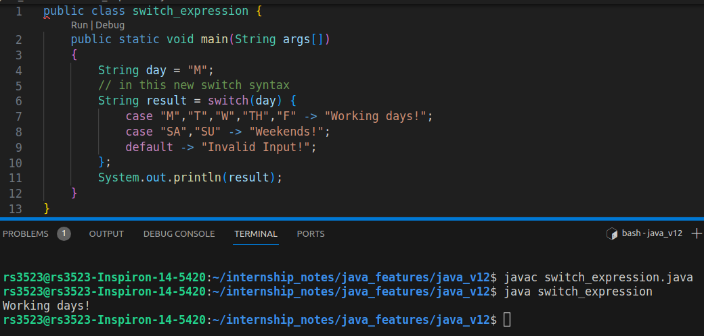

# Java version: 12
1. JVM Changes - JEP 189, JEP 346, JEP 344, and JEP 230.
2. Switch Expressions
3. File mismatch() Method
4. Compact Number Formatting
5. Teeing Collectors in Stream API
6. Java Strings New Methods - indent(), transform(), describeConstable(), and resolveConstantDesc().
7. JEP 334: JVM Constants API
8. JEP 305: Pattern Matching for instanceof
10. Raw String Literals is Removed From JDK 12.