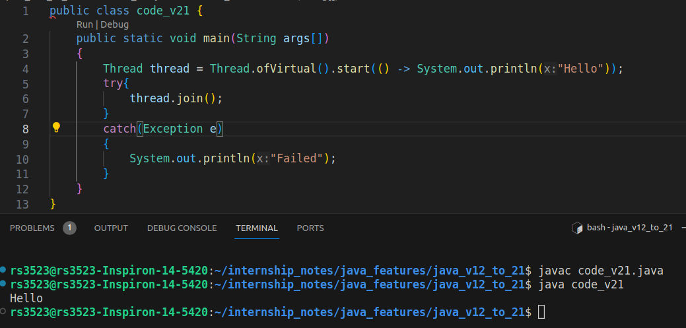

# Java version: 21

1. **Record Patterns**: Enhances the language with record patterns to deconstruct record values, enabling powerful and declarative data navigation and processing.
2. **Pattern Matching for switch Expressions and Statements**: Extends pattern matching to switch expressions and statements, enabling concise and safe data-oriented queries.
3. **Virtual Threads**: Adds support for JVM-managed lightweight threads, enabling high-throughput concurrent applications.
    ```
    Thread thread = Thread.ofVirtual().start(() -> System.out.println("Hello"));
    thread.join();
    ```
    