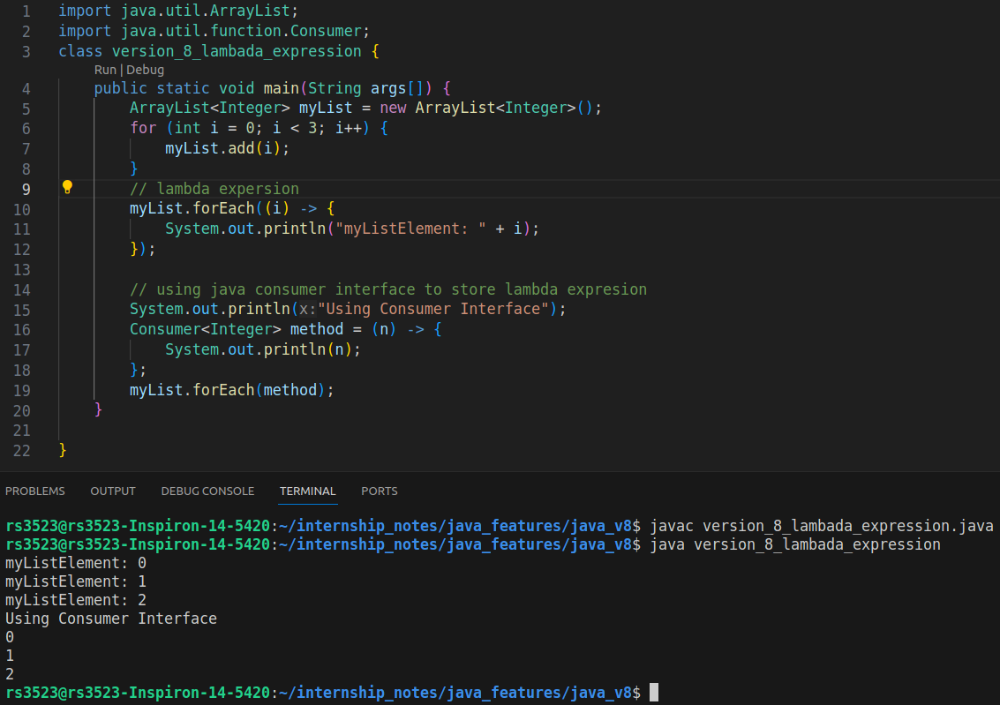
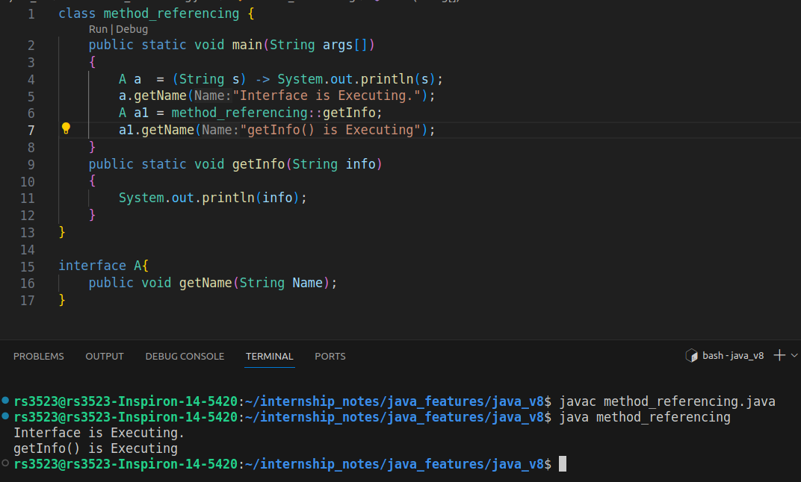
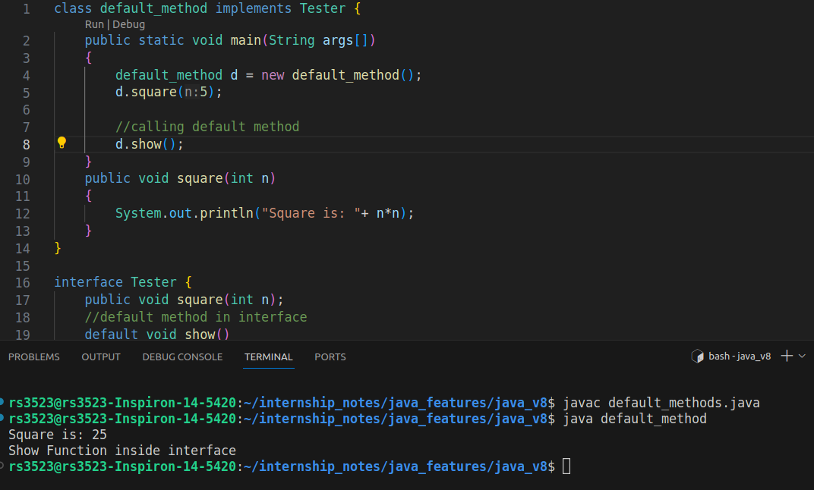

# Java version: 8

* **Lambda Expressions**, a new language feature, has been introduced in this release. They enable you to treat functionality as a method argument, or code as data. Lambda expressions let you express instances of single-method interfaces (referred to as functional interfaces) more compactly.!

* Method references provide easy-to-read lambda expressions for methods that already have a name.

* Default methods enable new functionality to be added to the interfaces of libraries and ensure binary compatibility with code written for older versions of those interfaces.

* Repeating Annotations provide the ability to apply the same annotation type more than once to the same declaration or type use.

* Type Annotations provide the ability to apply an annotation anywhere a type is used, not just on a declaration. Used with a pluggable type system, this feature enables improved type checking of your code.
* Improved type inference.
* Method parameter reflection.
