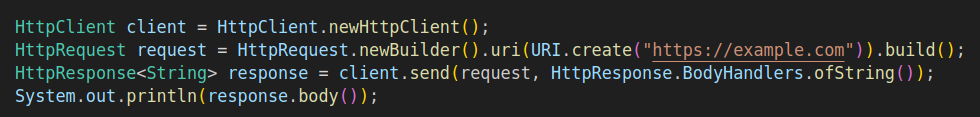

# Java version: 11

1. **HTTP Client (Standard)**: Provide a native HTTP client to simplify communication with web services. 

```
HttpClient client = HttpClient.newHttpClient();
HttpRequest request = HttpRequest.newBuilder().uri(URI.create("https://example.com")).build();
HttpResponse<String> response = client.send(request, HttpResponse.BodyHandlers.ofString());
System.out.println(response.body());

```

2. **Local-Variable Syntax for Lambda Parameters**: Extend the use of var to lambda expressions.